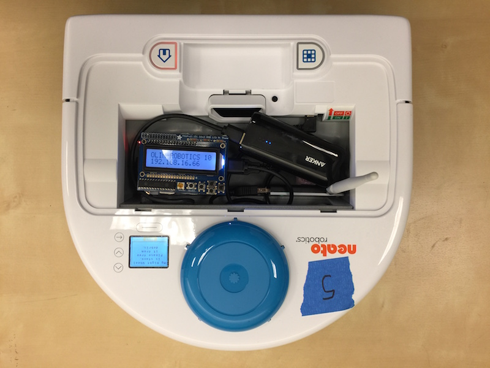
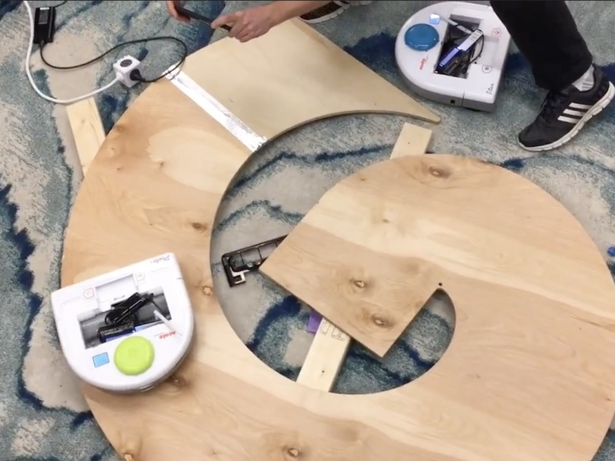

# Integrating Math, Physics, and Engineering: Robo Ninja Warrior

Todo include module overview

*Inspired to learn more?  E-mail <a href="mailto:Collaboratory@olin.edu">Collaboratory@olin.edu</a>.*

## Overview and Pedagogy of Quantitative Engineering Analysis

 <iframe width="560" height="315"
src="https://www.youtube.com/embed/MFL4gd2IMm8" 
frameborder="0" 
allow="accelerometer; autoplay; encrypted-media; gyroscope; picture-in-picture" 
allowfullscreen></iframe>

## Module Overview

## Robot Platform

### Supporting Documents and Tutorials

* [Meeto your Neato!: Environment Setup and Connecting](How to/Environment Setup and Connecting to the Neatos.pdf) 
* For teaching team members: [Platform Conversion Instructions](How to/Platform Conversion Instructions.pdf)
* For teaching team members: Raspberry Pi Setup (NEED TO CREATE)
* For teaching team members: Shopping list (NEED TO CREATE)

## Intro to Mobile Robotics

### Schedule and Supporting Documents

* [Day 1: Introduction to Mobile Robotics Sensory Motor Loops, Motion of Rigid Bodies](Day 1- Intro to Mobile Robotics/M3_Day1.pdf)

## Challenge 1: Crossing the Bridge of Doom

### Schedule and Supporting Documents

* [Night 1: Parametric Curves and Motion](Night 1- Parametric Curves, etc/M3_Night1.pdf)
* [Day 2: Curves, Motion, and Neato](Day 2- Curves, Motion, and Neato/M3_Day2.pdf)
* [Night 2: Angular Velocity, NEATOs, and Partial Derivatives](Night 2- Robot Velocities, Partial Derivs, Chain Rule/M3_Night2.pdf)
* [Day 3: Encoders, Mapping, and Intro to the Bridge of Doom](Day 3- Encoders and Mapping/M3_Day3.pdf)
* [Night 3: Crossing the Bridge of Doom](Night 3- Bridge of Doom/M3_Night3.pdf)

## Challenge 2: Flatland

TODO: are there any pictures of Flatland?

### Schedule and Supporting Documents

* [Day 4: Optimization](Day 4- Optimization/M3_Day4.pdf)
* [Night 4: Optimization and Gradient Ascent](M3_Night4.pdf) (with solutions)
* [Day 5: Flatland Challenge](Day 5- Flatland/M3_Day5.pdf)

### Deprecated version

In the past we've done a version of this challenge where the Neato uses its accelerometer to implement steepest ascent to navigate to the top of a physical mountain.

* [Link to an image of students watching their robot ascent the mountain](website_graphics/annie_nina_mount_doom.jpg)
* [Link to video of a student's robot ascending the mountain](https://www.youtube.com/watch?v=t7Caw4KeEV4)

### Challenge 3: The Gauntlet

### Schedule and Supporting Documents

* [Night 5: Polar LIDAR Express](Night 5- LIDAR/M3_Night5.pdf)
* [Day 6: The RANSAC Algorithm and Finding Lines](Day 6- RANSAC/M3_Day6.pdf)
* [Night 6: Frames of Reference and LIDAR](Night 6- Frames of Reference and LIDAR/M3_Night6.pdf) (with solutions)
* [Day 7: Potential Fields](Day 7- Potentials and Gauntlet intro/M3_Day7.pdf)
* [Night 7, Day 8, Night 8: The Gauntlet](Night 7 and 8- Gauntlet Challenge/M3_Night7_and_8.pdf)
* [Day 9: Module and QEA Synthesis and Reflection](Day 9 - Final Event/FinalEvent.pdf)

## Conclusion and Learning More

TODO

### Other Documents on QEA

* Siddhartan Govindasamy, Rebecca J. Christianson, John Geddes, Christopher Lee, Samantha Michalka, Paul Ruvolo, Mark H. Somerville, Alexandra Coso Strong: [A Contextualized, Experiential Learning Approach to Quantitative Engineering Analysis](https://ieeexplore.ieee.org/document/8658526), FIE 2018.

### Connect with Olin's Collaboratory

To connect with folks at Olin College to learn more about this module or determine how you might build off of this at your own institution, e-mail <a href="mailto:Collaboratory@olin.edu">Collaboratory@olin.edu</a> to start the conversation.
